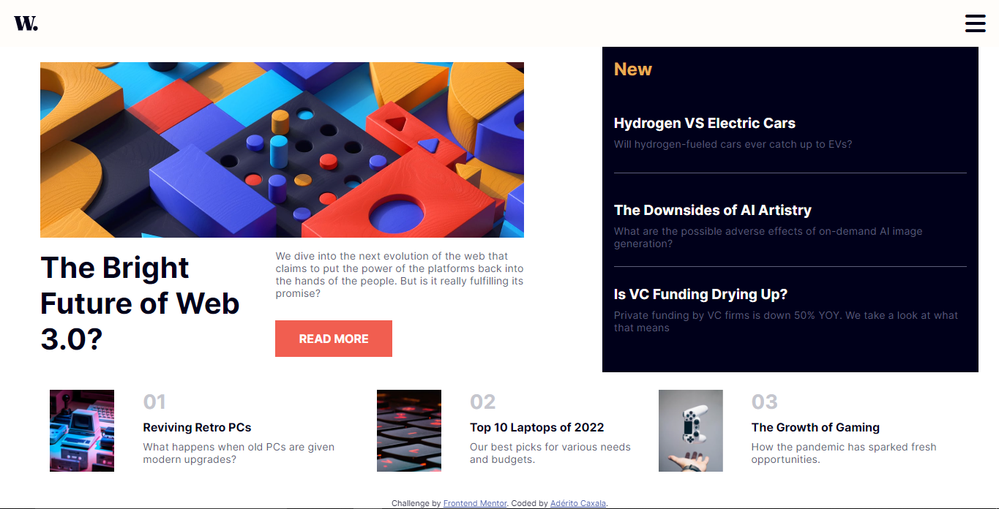
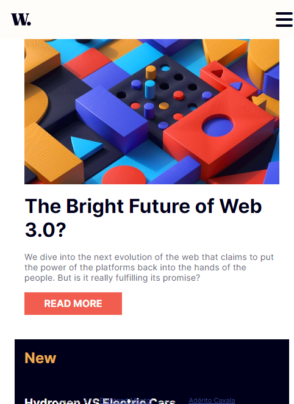

# Frontend Mentor - News homepage solution

This is a solution to the [News homepage challenge on Frontend Mentor](https://www.frontendmentor.io/challenges/news-homepage-H6SWTa1MFl). Frontend Mentor challenges help you improve your coding skills by building realistic projects. 

## Table of contents

  - [The challenge](#the-challenge)
  - [Screenshot](#screenshot)
  - [Links](#links)
  - [Built with](#built-with)
  - [What I learned](#what-i-learned)
- [Author](#author)

### The challenge

Users should be able to:

- View the optimal layout for the interface depending on their device's screen size
- See hover and focus states for all interactive elements on the page

### Screenshot

### Links

- Solution URL: [here](https://github.com/Heliandro1/news-homepage-main)
- Live Site URL: [here](https://news-homepage-weld.vercel.app/)

### Built with

- Semantic HTML5 markup
- CSS custom properties
- Flexbox
- CSS Grid
- Mobile-first workflow

### What I learned
In this project i could improve my CSS Grid skills 

## Author
- Frontend Mentor - [@heliandro1](https://www.frontendmentor.io/profile/heliandro1)
- Linkedin - [@adérito-caxala](https://www.linkedin.com/in/adérito-caxala)
- Instagram - [@heliandro_10](https://www.instagram.com/heliandro_10)
- Facebook - [@Heliandro](https://www.facebook.com/heliandro.1)

